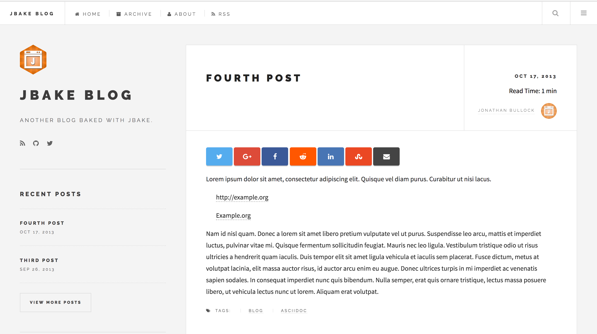

# JBake Future Imperfect Template

**_Compatible with JBake 2.6.5_**

Future Imperfect is based on [HTML5 UP's theme](http://html5up.net/future-imperfect). Julio Pescador [ported](https://github.com/jpescador/hugo-future-imperfect) it for SSG websites. Here, it adapted for [JBake](http://jbake.org/).



Live example can be seen [here](https://unittesters.com/).

## Getting Started

First, make sure you install JBake as per instructions [here](http://jbake.org/download.html).

Once you have JBake, assuming you are creating a site called '**awesome-jbake**', in the terminal/command window run below commands -

```shell
>> mkdir awesome-jbake

>> git clone https://github.com/manikmagar/jbake-future-imperfect-template.git awesome-jbake

>> cd awesome-jbake && ls -ltr

```

You should see this repo files in there. Check [JBake 2.5.1 Documentation](https://jbake.org/docs/latest/#project_structure) to understand this structure.

To see in action, while in awesome-jbake folder, run `jbake -b -s`. In few seconds your site should be live on http://localhost:8820/, you can visit it in browser.

## Configuring jbake.properties

Everything in the template is driven by configuration parameters in jbake.properties file. Minimally required property set is already included, So keep all the properties in file and modify the values as needed.

JBake does support more than these properties and you can refer [JBake Documentation](http://jbake.org/docs/).

Some tempalte features are described below.

### Disqus Comments

Template does support adding [Disqus](https://disqus.com/) comments to Posts. To enable it, just add your disqus shortname in jbake.properties -

`site.disqus.shortname={yourdisqus}`

### Google Analytics

Template allows you to capture Page Views. To enable it, just add your GA Tracking id in jbake.properties -

`site.google.trackingid={ga.trackingid}`

### Estimated Reading Time

You can enable Estimated Reading time on your posts, by setting `site.includeReadTiem=true` in jbake.properties. This reading time is calculated using [this](https://github.com/michael-lynch/reading-time) reading time javascript library.

### Site Main Menu

Site's top main menu can be controlled from jbake.properties -

```properties
site.menus.main = home, archive, about, rss
#To add menus, for every menuitem in site.menus.main, add three properties in below pattern
#site.menus.{menuitem}.home.label=Home
#site.menus.{menuitem}.home.url=/
#site.menus.{menuitem}.home.icon=fa fa-home

site.menus.main.home.label=Home
site.menus.main.home.url=/
site.menus.main.home.icon=fa fa-home

```

You MUST define label, url and icon properties for each menu item in `site.menus.main`.

### Social Links

You can control your social links by adding your social handlers for sidebar.social.* propeties.

## Adding 404 page not found for GitHub

If you are hosting your static site on Github, then Github allows to set 404 error page. Content folder has a file called 404.html which is of type 'page' (i.e. it will be rendered by page template). You can modify this file content if neeeded but default included one also looks good :). This file **must be** at the root of content folder so that it gets rendered to root directory of your github pages. Rest will be take care by Github to show this file when user tries to non-existent url.

## Post Featured Images

In the [post metadata header](http://jbake.org/docs/2.5.1/#metadata_header), you can define below two properties to have a featured image for the post -

```properties
featuredimage=img/{path to image}
featuredalt=alternate text for image
```

## Feeds
### JSON Feed
This template by default generates [JSON feed](https://jsonfeed.org/version/1). Following is the configuration related to this -
```properties
site.menus.main.rss.label=Subscribe
## change below url to feed.xml for tradional RSS Feed
site.menus.main.rss.url=feed.json
site.menus.main.rss.icon=fa fa-rss

## Commnet below two properties to generate, tradional XML RSS feed.
feed.file=feed.json
template.feed.file=feed-json.ftl

```

### RSS XML feed
It is possible to have tradional XML RSS feed. Make the changes in jbake.properties, as suggested in comments above. Bake your site again.


## About me

Feel free to give a shout on twitter [@manikmagar](https://twitter.com/manikmagar) and [@javabake](https://twitter.com/manikmagar)

## License

This theme is released under the MIT license. Please read the [license](LICENSE.md) for more information.
